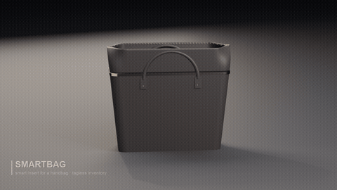
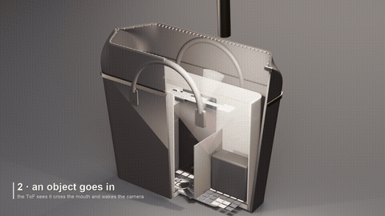
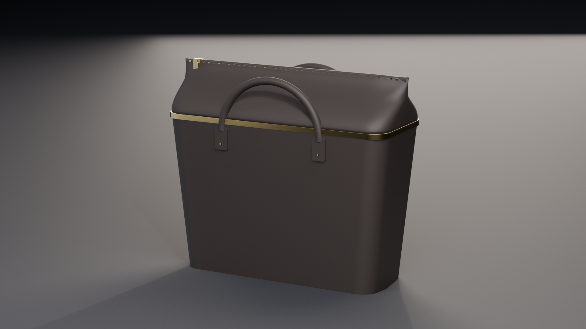
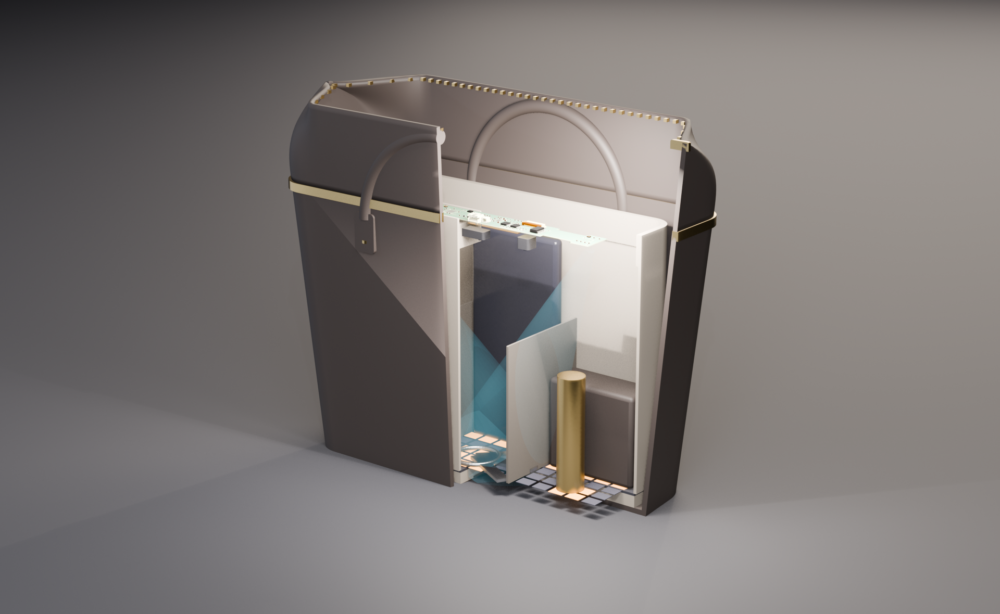
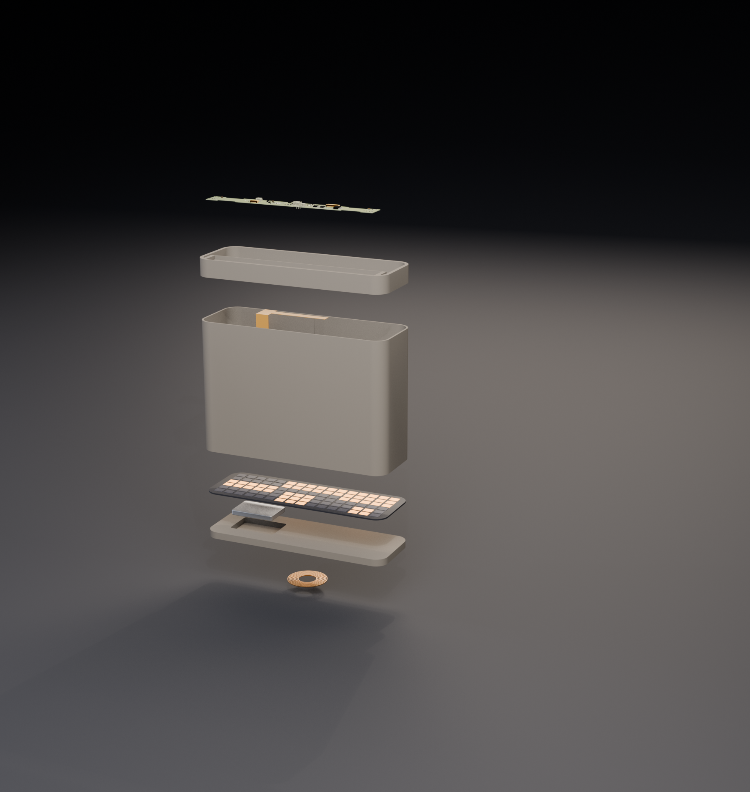
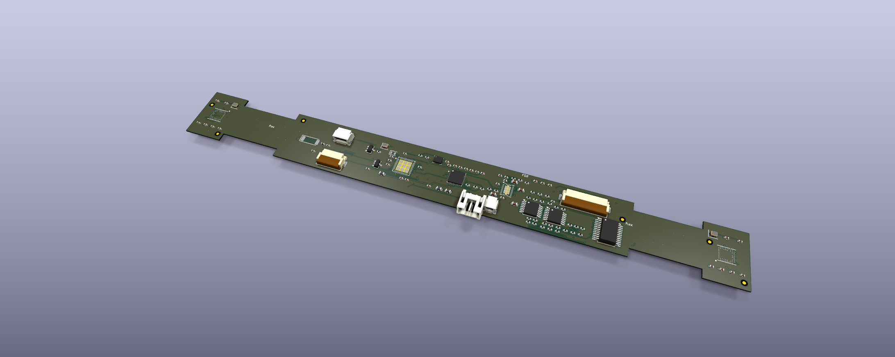
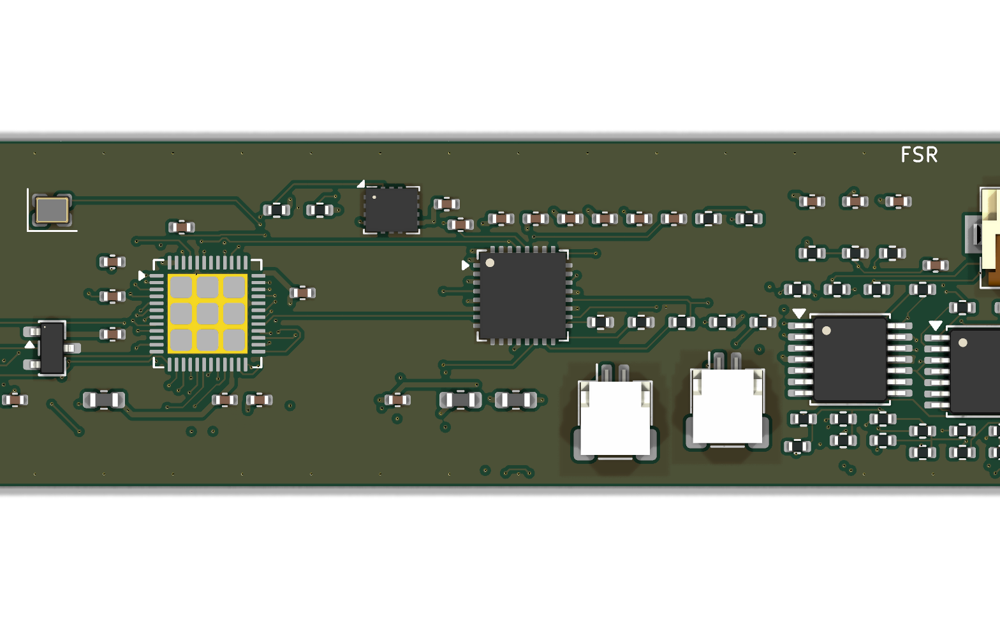

# SmartBag

**A removable smart insert for a handbag that recognises what is inside it —
without putting a tag on anything.**

Everything in this repo is generated by script: the PCB, the CAD, the renders,
the films. One command runs the whole chain, from KiCad to a finished MP4.

[](media/smartbag.mp4)

> *The GIF above is a short preview — click it for the full film.*
>
> **[▶ smartbag.mp4](media/smartbag.mp4)** (23 s) — how it is built ·
> **[▶ smartbag_sequence.mp4](media/smartbag_sequence.mp4)** (22 s) — how it works

---

## Read this first

This is a **design study**. Some of it is now checked by machine; none of it has
been built.

| | |
|---|---|
| schematic | **exists**, generated from `hardware/netlist.py`. **ERC: 0 violations.** |
| board | **111 footprints, four layers, routed.** DRC: **0 errors, 0 footprint errors**, schematic parity clean. **4 items of ~500 still need finishing by hand** — see [Routing](#routing). |
| part numbers | ⭐ **every IC is a real part, and its pinout comes from its own datasheet.** `tools/bom_report.py` measures each footprint against the datasheet's package on every run: **23 of 23 agree** — see [The bill of materials](#the-bill-of-materials). |
| firmware | the wake-up chain, the ledger, the taxel driver, the GATT layer, **the charge policy and the sensor bring-up** — **690 assertions**, `-Werror`. What is left is nine HAL functions and a vendor BLE stack, and they are named. |
| recognition on the real part | the SoC has **no NPU**, so it was costed: 6.99 M MACs a frame on a 128 MHz M33 is **110–191 ms** against a settle window of 2000 ms — see [Recognition fits](#recognition-fits-the-processor). |
| recognition | an **enrolment pipeline that runs and is measured** — see [Recognition](#recognition). ⚠️ It now has to run on a Cortex-M33, not an NPU. |
| app | **written and running** — [`app/`](app/), tested against the firmware's own bytes. No native build; it is a web app. |
| RF | full-wave simulation rejected the antenna, closed-form analysis then rejected the whole feed — and the real part **dissolved the problem**: 60 GHz silicon has the antenna inside the package. There is now **no 60 GHz copper on this board.** See [RF](#rf). |
| thermal | **analysed** ([`thermal/budget.py`](thermal/budget.py)). It asked for charge current to be a function of cell temperature; the cell now has an NTC **in the pack**, a PMIC that reads it, and a policy under 264 assertions. |
| the taxel front end | measured wrong, then **fixed in hardware**: six transimpedance amplifiers and a 16:1 multiplexer — see [The taxel matrix](#the-taxel-matrix). |
| the 2.4 GHz antenna | ⛔ its datasheet found **three errors** in this design, one of them a terminal tied to ground that the part marks NC — see [The antenna](#the-antenna). |
| the optics flex | **exists now.** J1 was a connector to nothing for the whole project: the camera, the illuminators and the ToF live here. DRC 0 errors, 1 unconnected item. |
| the taxel sheet | **exists now.** 96 interdigitated sites, 16 columns and 6 rows, no components. **DRC 0 errors, 0 unconnected pads.** |
| fabrication | Gerbers, drill, placement, DRC reports and a generated fab note for **all three boards**: `tools/fab.sh`. |
| wireless power | ⛔ there was **no Qi receiver**: a coil was wired straight into a PMIC input that wants 4.0–5.5 V DC. There is now a BQ51013B, a dual resonant tank computed from the coil's own inductance, and a rectifier — see [Wireless power](#wireless-power). |

Run everything that can be checked:

```bash
./tools/verify.sh
```

```
== design constraints ==   all constraints hold
== firmware ==             28 + 324 + 53 + 264 + 21 checks, 0 failures
== protocol ==             15 tests passed
== ERC ==                  0 violations
== DRC ==                  0 errors · 4 unconnected pads · 0 footprint errors
== the other two boards == optics 0 errors, 2 pads · taxels 0 errors, 0 pads
== BOM vs footprints ==    23 of 23 named parts have a real MPN whose package fits
== recognition ==          ⭐ IT FITS, AND WITH ROOM
== physics ==              ✅ the 60 GHz feed question is settled
                           ⛔ Charging as specified puts the cell over its limit.
```

⚠️ The last two lines are printed on every run **on purpose** — and they are the
two findings that **rewrote the board**. The feed loss deleted the 60 GHz copper
and split one transceiver into two sensors; the charging analysis added a
thermistor and chose the PMIC. One is now a ✅ and one is still a ⛔, and both
keep printing: a suite that only reported its passes would be helping to forget
why the design looks the way it does.

## What it is

An **organiser that drops into any handbag** and knows what is inside it,
without tags on the objects:

| | |
|---|---|
| **IR camera** at the mouth | classifies each object as it enters or leaves |
| **60 GHz radar**, two 2×4 patch arrays | maps the volume through fabric — *where* it landed |
| **96-taxel FSR floor** | mass and footprint — *how heavy* and *what shape* |
| **ToF + Hall sensor** | the wake-up chain: closure opens → object enters → camera fires |
| **IMU** | integrates disturbance: tells the map when it has gone stale |

The bag itself is never modified, so the bag's value is never touched. The
insert slides out and moves to another one.

## The films

### smartbag_sequence.mp4 — how it works

[](media/smartbag_sequence.mp4)

1. **the zip opens** — the slider runs, the mouth gapes, the Hall sensor on the
   closure wakes the system
2. **an object goes in** — the ToF intercepts it crossing the mouth
3. **the IR camera fires** — three frames as it passes; the object itself lights
   up under the flash
4. **the radar maps the volume** — where it landed
5. **the FSR matrix weighs it** — the taxels under the object light up *when it
   lands*, not before
6. the zip closes again

### smartbag.mp4 — how it is built

The bag opens in section, the insert comes apart into its five layers with the
real KiCad board on top, the taxels light in a wave under the contents, then it
closes.

## Stills

| | |
|---|---|
|  |  |
| the bag closed: pinched neck, zip pulled shut | the section: contents upright, radar beam, taxels lit |





---

## The pipeline

```
hardware/generate_pcb.py  ──> smartbag_core.kicad_pcb ──> KiCad raytracer renders
                                       │
                                       └─ kicad-cli export glb ──┐
cad/bag_and_insert.py     ──> 15 STL (bag + insert) ─────────────┴─> render/scenes.py
                                                                     (Blender EEVEE)
```

```bash
python3 tools/check.py             # the constraints, in ~0.1 s
./tools/pipeline.sh 1920           # circuit -> geometry -> stills   (~45 s)
./tools/render_animation.sh 1600   # 696 animation frames            (~26 min)
python3 render/build_video.py      # captions, fades, ffmpeg encode  (~3 min)
```

⭐ **`tools/check.py` asserts what the renders discovered.** Every constraint in
it was found the expensive way — modelling something, rendering it, and seeing
it was wrong. A board 51 mm deep in a 4 mm collar wall; an FSR tail 40 mm long
against a 150 mm drop; an object landing on top of a divider. None of those
raise an error anywhere: they produce a picture that looks fine until you look
closely. Written down as assertions they cannot silently come back — and the
first time it ran it caught three more, all invisible in the renders because
something else happened to be in front.

⭐ **It is a chain, not three separate things.** The PCB does not end up in a
PDF: it is exported to GLB and becomes an object in the *same Blender scene* as
the bag. That is the only way to find out that a board does not fit where it was
supposed to — and that is exactly what happened.

## Real numbers

| | |
|---|---|
| bag | 240×95 (floor) → 276×112 at 190 mm, 3.5 mm leather; soft neck 190→245 mm |
| insert | 225 × 78 × 180 mm, removable |
| board | 196 × 20 mm strip, 0.6 mm rigid islands on 2-layer polyimide flex |
| FSR matrix | 16 columns × 6 rows = 96 taxels, 22 lines on a 24-way FFC |
| radar arrays | 2 × (2×4 patches), 2.5 mm pitch = λ₀/2 at 60 GHz |
| battery | **Jauch LP523450JU**, 950 mAh, 53 × 34.5 × 5.8 mm, with PCM and a 10 k NTC on its harness — beside the Qi coil, not on top of it |

## What the renders actually rejected

This is the part worth reading. Putting the PCB and the CAD in the *same scene*
killed several things that looked fine on paper:

- **The first board layout was impossible.** A 126×51 mm cross with the FSR tail
  dropping out of the middle. Dropped into the insert, a board 51 mm deep either
  spans the mouth floating in mid-air or pokes out of the bag: the collar wall is
  4 mm. Redrawn as a **196 × 20 strip** sitting in a 24 mm front band.
- **The FSR tail on the board did not reach the floor.** 40 mm of flex against a
  150 mm drop. It became a **separate FFC** on J4 — which is also how it would
  really be assembled, because the cable has to pull out.
- **The insert has to pass through the smallest cross-section**, the floor, not
  the mouth. Hence 225×78 and not 240×82.
- **The bag never actually closed.** It was an open-mouthed tote, so the only
  thing "opening" was the section. Without a real closure there is no Hall
  sensor either — and that is the first link in the whole chain.
- **A zip is not a hinge; it is a mouth that pinches shut.** Four attempts
  rotated two rigid flaps hinged on the rim (up, down, inwards, outwards). All
  four read as a *hatch*, because two rigid plates rotating about a hinge **are**
  a hatch. The problem was upstream: a bag modelled as a rigid box cannot have a
  credible closure. The rigid body now ends at 190 mm and the last 55 are a
  **soft neck** — a surface with two states (oval mouth / mouth pinched to
  11 mm) interpolated by a shape key. The two rows of teeth do not rotate, they
  **separate**.
- **A zip has to be able to end somewhere.** With a rounded-rectangle mouth the
  teeth stayed 100 mm apart even at the tips and the slider finished its travel
  floating in mid-air. The mouth is now a **pointed oval**: the depth is squeezed
  to 4.5% over the last 40 mm, and only in the upper part of the neck (t³ —
  applied in proportion to height, the ends became wedges and from the side the
  bag looked like it had a pitched roof).
- **The object landed inside another object.** It fell at x = 44, straddling the
  divider at x = 37.5. Moved to x = 60, checked against divider, pouch and keys.
  The number lives in one place, `CONTENTS`, and both the render and the taxel
  logic read it from there.
- **The camera did not exist.** There was a pink cone flashing, but no module
  emitting it: light came out of a hole in the microfibre. A sensor you cannot
  see is a sensor nobody understands. There is now a module with its lens and
  four illuminators — and the **object lights up too**, which is the only thing
  that makes clear the flash is hitting it.
- **The hand was deleted.** Four attempts (from above, tilted, in section, with
  tapered and curled phalanges) and it stayed the worst thing in the frame while
  stealing attention from the sensors. An object descending on its own is
  understood in the first frame and has nothing to get wrong.

## The circuit

The connectivity is declared once, in [`hardware/netlist.py`](hardware/netlist.py):
pins, electrical types and nets for 26 parts. Three things consume it — the
schematic generator, the board generator, and the checks — so the board and the
schematic cannot drift apart. `kicad-cli pcb drc --schematic-parity` reports
**0 footprint errors**, which is that claim, verified.

**ERC found two things that were genuinely missing**, and the fix was to add
them rather than to silence the check:

- **no way to program the board.** SWDIO and SWCLK went nowhere. There is now a
  4-way SWD connector (J5), with its pins declared *bidirectional*, which is
  both electrically accurate and what makes ERC see the SoC's SWCLK input as
  driven.
- **a BLE radio with no antenna.** The SoC's ANT pin connected to nothing. There
  is now a 2.4 GHz chip antenna (AE1).

**DRC went from 439 violations to 0**, and almost all of the reduction was
deleting something rather than adding it:

| | |
|---|---|
| 439 → 215 | the board never declared its process. It is 0.1 mm lines on 2-layer polyimide flex with 0.3/0.15 vias; judged against KiCad's generic 0.2 mm defaults it collected 108 track-width and 112 via/drill violations that said nothing about the layout. |
| 215 → 1 | **the decorative routing.** Before there was a netlist, the generator drew bundles of tracks on net 0 to make the renders look like a circuit. Once the pads carried real nets, DRC read those tracks for what they were: 40 shorts, 6 clearance violations, 168 solder-mask bridges — one object producing more than half the errors on the board. |
| 1 → 0 | a courtyard overlap, and silkscreen. |

⛔ **The board is not routed.** Fanning out a 0.4 mm-pitch QFN-48, laying a
22-line bus and two 60 GHz microstrip feeds is a real job, and faking it with
decorative polylines is exactly the mistake that was just removed.

## RF

[`rf/patch_sim.py`](rf/patch_sim.py) solves Maxwell's equations on the patch
element with openEMS — ground plane, dielectric, patch, probe feed — and it
**falsified the antenna as first drawn**.

The setup is validated first, because a negative result is only worth stating if
the same solver reproduces a case theory says should work: a patch sized by the
transmission-line model (1.31 mm on 0.127 mm) comes back at **59.0 GHz, −9.3 dB**
— within 1.7% of target.

| substrate | patch | f_res | S11 | −10 dB BW | |
|---|---|---|---|---|---|
| 0.600 mm | 1.20 mm | 50.8 GHz | **−2.5 dB** | 0 | the rigid stack, as first drawn |
| 0.250 mm | 1.20 mm | **59.9 GHz** | **−27.2 dB** | **3.5 GHz** | the antenna islands, as now specified |

⛔ **On the 0.6 mm rigid stack the element does not work.** It sits 9 GHz low and
reflects almost everything. `h/λ₀` was 0.12, which is enormous at 60 GHz — the
board is 0.6 mm because that is what the rigid islands are, and nobody had
chosen that number for the antenna.

⭐ **The fix is the stackup, not the artwork.** At 0.25 mm the *same* 1.2 mm patch
matches at −27.2 dB with 3.5 GHz of bandwidth. On a rigid-flex board that costs
nothing: the antenna areas keep the flex core and a thin stiffener instead of the
full rigid buildup. A `.kicad_pcb` carries one board thickness, so it is a
fabrication note, on the Cmts.User layer and in `dimensions.py`.

⚠️ One element in isolation. No array coupling, no flex bend, no connector
parasitics, and εr is assumed — the numbers move with it.

**Getting the simulation to run at all took four wrong hypotheses.** It kept
returning `Energy: ~ nan` from the first timestep, and PML-over-a-conductor, the
lossy dielectric and the port were all blamed before a uniform-mesh control case
came back clean and pinned it on **mesh grading**: a 16:1 jump from the cells
over the patch to the far field. FDTD does not error on that, it silently
returns NaN. `rf/patch_sim.py` now refuses to run a mesh that will diverge, which
turns ninety wasted seconds into one line of output.

```bash
python3 rf/patch_sim.py --sweep
```

### And then the feed, which is worse

Fixing the element fixed the element. [`rf/feed_loss.py`](rf/feed_loss.py) asks
the next question — what does it cost to *reach* it — and the answer ends the
architecture.

The transceiver sits in the middle of a 196 mm board. The two antenna islands
are at the ends, 87 mm and 99 mm away. On the 0.25 mm substrate a 50 Ω line is
0.58 mm wide, and at 60 GHz it loses:

| | |
|---|---|
| dielectric | 0.64 dB/cm |
| conductor, roughened | 0.31 dB/cm |
| **total** | **0.94 dB/cm** |
| over 88 mm | **8.2 dB one way, 16.5 dB there and back** |

⛔ **A radar link budget goes as the fourth power of range.** 16.5 dB round trip
is a factor of 2.6 in range thrown away before the antenna has radiated
anything — on a sensor whose entire job is to see through 78 mm of handbag.

⭐ **This is not a routing problem and no layout fixes it.** The distance is the
floorplan, and the floorplan is the product: the two islands are at the ends
*because* two separated viewpoints are what makes the map work. Three ways out,
all of them architectural:

- a transceiver **on each island**, with a low IF and a reference clock
  distributed down the flex instead of 60 GHz;
- both antennas **next to the transceiver**, giving up the two viewpoints;
- **one island**, and a single viewpoint.

### And then a real part settled it

⭐ **The parts search dissolved the problem.** [`hardware/bom.py`](hardware/bom.py)
went looking for a 60 GHz transceiver you can actually buy. The Acconeer **A121**
is a 50-ball fcCSP, 5.2 × 5.5 × 0.88 mm, 57–64 GHz, 1.8 V, SPI — and its
datasheet says, in so many words:

> "The product has integrated antennas in package, it is not possible to connect
> trace antenna."

There is no 88 mm feed to lose 8.2 dB in, because **a real 60 GHz part is placed
where its antenna has to be.** That is option one above, arrived at by the parts
bin rather than by choice: `ANT_A1` and `ANT_A2` should not be nets, the two
antenna islands should be two sensors, and what runs down the flex to each of
them is SPI at a few tens of MHz instead of 60 GHz.

⚠️ Which also means the footprint on the board — a QFN-40 with four antenna
ports — is for a part that does not exist. That is one of the three mismatches
in [the bill of materials](#the-bill-of-materials).

```bash
python3 rf/feed_loss.py
```

## The board, rebuilt around parts you can buy




*Top: the whole 196 mm strip — two rigid end islands carrying a radar each, two
flex tails, and the centre island. Bottom: the centre island, where the QFN-48
processor, the QFN-32 PMIC, the taxel front end and the connectors live.*

The first version of this board was drawn from component *classes* — "SoC+NPU
BLE 5.4", "mmWave 60 GHz TRX" — with pinouts invented to suit. It said so, which
is better than not saying so, and it was still unbuildable: no real SoC has
ground on exactly pins 3 and 4. Going and finding the real parts changed the
architecture three times, and every change had already been asked for by
something else in this repo.

| what the parts changed | what had asked for it |
|---|---|
| **two radars, one on each end island, and no 60 GHz copper at all** | `rf/feed_loss.py` priced a central transceiver's feed at 8.2 dB one way. The Acconeer A121's datasheet then said the antenna is inside the package and *"it is not possible to connect trace antenna"*. The feed does not exist because a real part is placed where its antenna has to be. |
| **an NTC on the cell, into a PMIC that does JEITA charging** | `thermal/budget.py` put the cell near 60 °C on a 5 W charge against a 45 °C limit and asked for charge current to be a function of cell temperature. The nPM1300 has the input; the invented PMIC had nowhere to put one. |
| **six transimpedance amplifiers and a 16:1 multiplexer** | `firmware/test_sb_fsr.c` measured both scan modes the old board could run: one invents phantom taxels at 39% of a real press, the other reads real ones 83% light. |

⚠️ **And one thing the parts took away.** No BLE SoC in a QFN has an NPU *and* a
camera interface — the ones with an NPU are BGAs with no radio, the ones with a
radio have no NPU. The processor is an **nRF54L15**, a 128 MHz Cortex-M33, and
recognition has to run on it. That is survivable only because the firmware
already waits 2 s for an object to settle before measuring, so inference happens
inside a window that existed anyway.

⭐ **And it has now been counted rather than hoped for.**
[`ml/inference_budget.py`](ml/inference_budget.py) hooks the model and adds up
its multiply-accumulates instead of guessing: **6.99 M MACs**, which is 110–191
ms on a 128 MHz M33 with CMSIS-NN depending on how many cycles per MAC you are
willing to believe. The settle window is 2000 ms. The margin is an order of
magnitude, which is the only reason losing the NPU was survivable.

**111 footprints: 23 named parts, 82 passives, 6 fiducials.** The floorplan lives
in one block in `netlist.py`; [`hardware/place.py`](hardware/place.py) turns it
into positions whose courtyards do not intersect, because a hundred hand-typed
coordinates always collide somewhere — the first pass collided in 28 places.

⚠️ **The fiducials are placed by a different rule from everything else**, and
finding that out cost thirteen DRC violations. A fiducial has no net and no
neighbour it wants to be near, so the push-apart loop has nothing to work with:
it shoved two of them into capacitors and stalled. Telling it to maximise
clearance instead was worse — it emptied every fiducial onto the least crowded
island and left three in a row, and three collinear marks tell a placement
camera about one axis. They are a **decision**: two per rigid island, diagonally
opposite, because the flex tails let the islands move with respect to each other
and a machine that has located one has learned nothing about the next. The
search only nudges them off whatever they landed on.

⛔ **Nothing sits on the flex.** The board is a 196 mm strip with two tails in it,
and a package soldered across a section that bends does not stay soldered. An
early placement pass put a 24-way connector and a row of resistors out over a
tail and off the board edge with them; the placer now knows about the three rigid
islands and refuses.

## Routing

**KiCad has no autorouter.** It had one through version 5 and it was removed, so
the flow is: `pcbnew` writes a Specctra `.dsn`, somebody else's router writes a
`.ses`, `pcbnew` reads it back. The router here is **Freerouting**, a maze router
with rip-up and retry.

```bash
tools/route.sh                      # generate → DSN → route → import → stitch → DRC
hardware/reroute_from_session.sh    # rebuild from the committed .ses, no Java
hardware/stitch.py                 # tie orphaned ground islands back to the plane
hardware/finish.py                 # try the last few by hand, with DRC as the judge
```

⭐ **`finish.py` exists because Freerouting recommends something it cannot do.**
When it stops improving it says so: *"it is recommended to stop it and finish the
board manually."* Manually is fine — but a person drawing four tracks and
eyeballing them is exactly the step this project avoids everywhere else. So the
candidates are drawn blind, seven shapes per pad, and **DRC decides**: a shape is
kept only if the board comes out with fewer unconnected pads and no new
violations, and reverted otherwise. It cannot make the board worse; the worst it
can do is fail to help, which on these four pads is what it reports.

⚠️ Its first version reverted by reloading the board from the file it had just
written the failed candidate into. Three rejected tracks accumulated in the
board and the tool reported the damage as its starting state.

| | |
|---|---|
| tracks / vias | **1713 / 393**, 4.3 m of copper |
| DRC | **0 errors, 0 footprint errors**, schematic parity clean |
| unconnected | **3 items of ~500** |
| layers | F.Cu 724 · In2.Cu 919 · B.Cu 70 · **In1.Cu 0 — a solid ground reference** |

⛔ **Sixteen of those twenty were a pin assignment, not a routing problem.** The
board first came back with one contiguous run of U1's pins unrouted — `MUX_S3`,
`MUX_EN_N`, `CS_RADAR_R`, `RADAR_IRQ_R`, `SPI_MOSI` — and the thing they had in
common was direction: every destination was tens of millimetres to the **east**,
and `MUX_S3` sat on pin 11, which is on the package's **west** edge. That net
began by crossing the whole processor before it could start travelling.

⭐ **Which GPIO carries which signal is a layout decision**, and on this part it
is nearly free: the firmware addresses pins through a HAL of symbolic ids, so
the physical assignment is invisible to it. The P2 block is now ordered by
destination — westbound nets on the west pins, eastbound on the east ones,
furthest travel on the outermost pin. `SPI_SCK`, `SPI_MOSI` and `SPI_MISO` do
not move, because those are the pins the high-speed SPIM is wired to in silicon
and the other instances run at 8 MHz instead of 32.

| | before | after |
|---|---|---|
| unconnected | 16 | **4** |
| autoroute time | 65 min | **15 min** |

⭐ **And one of the four was closed by writing a router for it.**
[`hardware/maze.py`](hardware/maze.py) is A* over a 0.1 mm grid, and it exists
because `finish.py` cannot go *around*: it tries a straight line and two L-bends
per layer, which on a board this dense all cross something. It reports that
honestly and stops.

| | |
|---|---|
| **zones are not obstacles** | almost all of F.Cu and B.Cu is ground pour. KiCad re-fills around new copper, so the route lays itself into the pour and the pour retracts. Treating the pour as solid finds no route anywhere. |
| **obstacles are drawn, not computed** | testing a million grid points against two thousand segments is a minute per net; drawing those segments with a brush already fattened by (their width + clearance + ours) is milliseconds. Pillow is the collision engine. |
| **DRC decides** | every route is applied to a copy, checked by a real `kicad-cli pcb drc`, and kept only if the board comes out with fewer unconnected items and no new violations. |

It closed `RADAR_IRQ_R`, the longest of them — 108 mm from U1 to U6, across both
flex tails.

⚠️ **The three that are left** are `VDD_3V3` at U1 pin 10, `RADAR_EN` at U2, and
one ground island with nowhere to put a via. The two signals are genuinely
sealed: a flood fill from U1 pin 10 reaches **79 cells** before it runs out of
board. At a 0.4 mm pitch the gap between two adjacent pads is 0.2 mm, and a
0.1 mm track with 0.1 mm either side needs 0.3 — so the escape has to go
outward, and outward is where the other forty pins already went. Closing them is
a floorplan change, not a better router.

⛔ **Turning U1 round is the obvious-looking fix and it does not work.** At 180°
and again at 90°, Freerouting's autorouter finished in minutes and its
*optimiser* then ground for over an hour without ever writing a session file —
three attempts, two angles, same outcome. Reassigning the pins got the same
result for free.

### Three hand-written attempts first, and what they got wrong

466, 989 and 852 violations. Two of the three conclusions drawn from them were
wrong, and finding that out was worth more than the attempts were:

| claimed | verdict |
|---|---|
| "at 0.4 mm pitch via-in-pad is not optional" | ⛔ **false for a QFN** — every pin is on the perimeter and escapes outwards. It is true for a 0.5 mm **BGA**, where four of the A121's signal balls are fully surrounded. Right conclusion, wrong package. |
| "two layers cannot carry this board" | still true, and still only ever measured on two layers. |
| "what is missing is a maze router with rip-up and retry" | ⭐ **true**, and the only one that mattered. |

⛔ **And one cause nobody had looked for.** Those attempts routed to 0.2 mm tracks
and clearances — KiCad's *generic netclass default* — because this project
declared its process **minimums** and never declared what the design **uses**.
DRC cannot complain that 0.2 mm is too wide when 0.1 mm is merely the floor. It
took handing the file to a router, which routes to the netclass, for the gap to
appear.

### What the router taught this board

- ⛔ **An autorouter given four signal layers will use four.** The first routed
  board put 34% of its tracks on In1.Cu — the layer a comment declared was
  "never routed on". A comment is not a rule. Marking it `power` in the DSN
  fixes it, and the price was measured: two signals stopped routing.
- ⛔ **The router has never heard of copper-to-edge clearance.** Specctra's
  boundary *is* the outline, so a via landed 0.120 mm from an edge against a
  0.150 mm rule. The first fix moved the via afterwards; it cleared the edge and
  landed 0.089 mm from a ground pad instead. **Nudging copper after the fact
  just moves a violation somewhere the router is no longer looking.** The
  boundary is now inset before the router ever sees it.
- ⛔ **A thermal spoke wider than its pad connects nothing.** J1's ground fingers
  are 0.3 mm and the zones used 0.4 mm spokes, so the pads sat isolated inside a
  ground pour and DRC reported them as unrouted ground — which reads like a
  routing failure and was a fill setting.
- ⭐ **Turning a part is free and turning it matters.** The A121's SPI pins are
  all on one edge of the ball grid; at 0 degrees that edge faced away from the
  processor on both sensors and the bus had to wrap around a 0.5 mm package.
  Rotating each sensor to face the processor took five unconnected pads off the
  board. ⚠️ Rotating the *processor* the same way looked like the same
  improvement and made Freerouting's optimiser grind for over an hour twice
  without producing a file — so it is not rotated, and `netlist.py` says why.
- ⛔ **A ground pour is not a ground plane until it is stitched.** Routing 1683
  tracks cut the top pour into islands, and an island with no via in it is not
  ground, it is a floating sheet of copper. `hardware/stitch.py` runs *after*
  routing — the islands are made by the routing, so they cannot be found before
  it — and closed six of the nine remaining unconnected pads.

  ⚠️ Its first version approximated each track by nine points to test clearance,
  which leaves 3 mm gaps in the middle of a 26 mm trace; a stitching via landed
  in one, 0.048 mm from a signal. A track is a segment and the distance to it is
  a closed form.

⭐ **The `.ses` is committed.** The routed board is a generated file — generator
plus routing session — and committing only the board would make the routing
something nobody could reproduce or review.

## Thermal

[`thermal/budget.py`](thermal/budget.py). **The interesting case is not the one
you expect.**

A 60 GHz ping and an NPU inference sound like the thermal problem. They are not:
0.15 s, forty times a day.

| | |
|---|---|
| every sensing load, averaged | **0.18 mW** |
| whole-bag rise from it | **+0.000 K** |
| worst burst, adiabatic, package only | **+5 K**, gone in seconds |

⛔ **Charging is the thermal problem.** 5 W in at 80% is a watt of loss for two
hours, inside a closed bag, with the Qi coil directly under the lithium cell —
and the insert wall between it and the outside world is soft microfibre over
foam, which is to say an insulator, chosen for exactly the reason it is bad here.

| | |
|---|---|
| wall, 3 mm of k = 0.05 | 11 K/W |
| surface | 23 K/W |
| **coil face** | **≈ 60 °C** |
| **cell temperature** | **≈ 26 °C**, against a 45 °C charging limit |

⭐ **The cell got out of it by moving, not by being argued with.** Every earlier
run of this model put the cell near 60 °C, and that number rested on one sentence:
*the Qi coil sits directly under the LiPo*. It did — because the cell was a
148 mm pouch drawn to fill the insert floor, and there was nowhere else for the
coil to go. Choosing **a cell you can actually order** made it 53 mm, which left
170 mm of floor free, so the two now sit **side by side**. The heat has to travel
62 mm along foam to reach the cell — 4493 K/W against the 23 K/W it would take
straight up to air — and takes **0.5%** of the coil's rise.

⚠️ **The finding moves rather than disappearing.** A watt still has nowhere to go;
all that changed is what is sitting on top of it. The coil face is still at
**≈ 60 °C**, against microfibre, foam and then leather, for two hours at a time.
Nothing there has a 45 °C limit, but leather ages and a bag is a thing people
hold — so the interlock keeps its place and changes its reason.

✅ **Implemented**, and the numbers are the cell's own rather than lithium's in
general. [`firmware/sb_power.c`](firmware/sb_power.c) holds the policy — full
current only with the bag **open** and the cell between **15 and 45 °C**, 2.9 W
otherwise, 0.5 C between 45 and 55, and nothing at all if the thermistor reads
open-circuit — under **276 host assertions**, including a sweep over every cell
temperature with the bag shut.

⛔ **Those thresholds were 10 and 40 until the cell was real.** Not wrong — a
guess that happened to be conservative, which is not the same as being right.
The LP523450JU datasheet states its own table (0.2 C from 0 to 15 °C, 1.0 C from
15 to 45, 0.5 C from 45 to 55) and `tools/check.py` now asserts the firmware
against it, so the two cannot drift apart again.

⛔ **And the thermistor moved off the board.** It was a 0402 NTC beside the PMIC,
which measures the PMIC: the cell whose temperature the entire policy is about is
twenty millimetres of foam away. It is now the third pin of the battery
connector, in the pack, where the nPM1300's datasheet calls it *the battery
thermistor* — so [`J2`](hardware/bom.py) is a 3-way SM03B-SRSS-TB and not the
2-way part it was. A pull-up resistor went with it: the PMIC's measurement is
ratiometric against its own reference, and a second pull-up to VSYS corrupts it.

⚠️ The number above is still what the hardware does **unconfigured**, and it is
kept for that reason — it is true on the first boot, before anything writes to
the PMIC. A limit is only real once somebody has set it.

```bash
python3 thermal/budget.py
```

## Wireless power

⛔ **There was no receiver.** For the whole project J3 was labelled *Qi coil* and
wired into the PMIC's VBUS — an input whose datasheet asks for **4.0 to 5.5 V
DC**. A coil on a charging pad does not produce that. It produces alternating
current at 100–200 kHz, at whatever amplitude the coupling happens to give, and
the design had nothing between the two. Every one of the checks in this
repository passed, because none of them knew what a coil is.

⭐ **What the missing piece actually is.** A Qi receiver is not a rectifier with
extra steps. It is a resonant network, a synchronous rectifier, and a
*communication channel* — the receiver tells the transmitter how much power to
send by modulating its own load, and a transmitter that hears nothing shuts down
after a few seconds. The part is a **BQ51013B**, and it brings eleven components
with it:

| | |
|---|---|
| **Cs**, series with the coil | **270 nF** C0G — resonates 8.8 µH at 100 kHz |
| **Cd**, parallel | **2.7 nF** C0G — the 1 MHz tank the transmitter pings to detect a receiver |
| **COMM1/COMM2** | the load-modulation capacitors that let the receiver talk back |
| **CLAMP1/CLAMP2, BOOT1/BOOT2** | overvoltage clamp and the rectifier's bootstrap rails |
| **RILIM, ADEN, FOD** | current limit, and the resistor divider that tells the transmitter what losses to expect |

Both resonant values come from the coil's own inductance rather than from a
reference design — [`hardware/qi_resonance.py`](hardware/qi_resonance.py) prints
them and, more usefully, prints how far they move if the assembled **L′** is not
the datasheet's 8.8 µH: 10% high takes Cs to 262 nF, 20% to 240 nF.

⚠️ **C0G is not a preference here.** Both capacitors carry the full coil current
at 100 kHz, and a class-II dielectric loses capacitance under bias — an X7R part
of the same nominal value detunes the tank as soon as it is working.

⚠️ **Still untuned on hardware.** The resonance is computed, the FOD divider is a
starting value, and neither can be finished without a built board: L′ has to be
measured on the assembled coil in its final position, and FOD has to be
calibrated against a real transmitter. Both are named in
[`fab/README-FAB.md`](tools/fab_notes.py).

## The taxel matrix

96 sensors on 22 wires and **not one diode** — that is what makes the matrix
affordable, and it is also a circuit in which current does not stay where you
put it.

[`firmware/test_sb_fsr.c`](firmware/test_sb_fsr.c) does not mock the hardware. It
builds the nodal admittance matrix of the real thing — 16 columns, 6 rows, 96
resistors, a sense resistor per row — and solves it. Press three taxels in an L:

| scan mode | the phantom taxel | a real taxel |
|---|---|---|
| unselected columns floating | **112 µS — 39% of a real press** | 289 µS |
| unselected columns grounded | 0 µS | **83 µS instead of 500 — 83% low** |
| rows at virtual ground (TIA) | 0 µS | **500 µS, exact** |

⛔ **Neither mode the board can actually run is usable.** Floating columns
manufacture objects that are not there — three contacts create a fourth, the
same sneak path that makes cheap keyboards register phantom keys, and a bag full
of objects is exactly the many-simultaneous-contacts case that provokes it.
Grounding the columns kills the phantom and then puts them in parallel with the
sense resistor, so every real taxel reads six times light whenever anything else
in its row is loaded.

⭐ **The third row is the control case, and it is what makes the other two mean
something:** the matrix is not inherently unreadable. Hold the rows at virtual
ground and every non-selected taxel has zero volts across it, carries nothing,
and the reading is exactly the selected taxel. That costs six op-amps, or one
plus an analog mux. Neither is in `hardware/netlist.py`.

⚠️ Selecting `SB_FSR_SCAN_TIA` in firmware on the board as drawn changes the
drive pattern and nothing else. This is a hardware gap, stated as one.

The same tests found an ordinary bug the interesting one would have hidden: blob
centroids were stored as `int16_t` micrometres, which saturates at 32.8 mm on a
225 mm insert. Every object in the outer two thirds of the bag reported the same
position, and it read as plausible because 32 mm is a real place.

## The bill of materials

`netlist.py` used to name component *classes* — "SoC+NPU BLE 5.4", "mmWave
60 GHz TRX" — and pick a package that looked plausible for each. ⛔ **That is a
comfortable way to be wrong: a footprint invented to fit an idea always fits.**

[`hardware/bom.py`](hardware/bom.py) names parts you can buy and copies their
package dimensions out of their own datasheets;
[`tools/bom_report.py`](tools/bom_report.py) measures what the KiCad footprints
actually are and prints every disagreement.

```bash
tools/fetch_datasheets.sh       # the PDFs are not committed — see below
python3 tools/bom_report.py     # writes hardware/bom.csv
```

**23 of 23 named parts agree with their datasheets**, and the three that did not
were fixed by changing the board, not the spreadsheet — see [the
rebuild](#the-board-rebuilt-around-parts-you-can-buy). Plus 82 passives, whose
values are read out of `netlist.py` rather than kept in a second list that can
drift.

⭐ **The check had to be rewritten twice before it was worth anything**, and both
mistakes are instructive:

| version | what it did | what it certified |
|---|---|---|
| 1 | counted `(pad "...")` records | **passed U2**, the worst mismatch on the board: KiCad splits a QFN-40 thermal pad into nine sub-pads, giving 40 + 9 + 1 = **50 pad records** — exactly the ball count of the 50-ball part it resembles in no other way. |
| 2 | counted distinct *numeric* pad numbers | scored the A121 at **zero pins**. A BGA's pads are named A1, K9, J10; a rule written for QFNs reports the part as empty rather than as wrong. |
| 3 | distinct pad **names**, minus mechanical ones | thermal sub-pads share a name and collapse to one, which is the behaviour that made the check worth writing. |

A coincidence in one number is all it takes for a naive check to certify the
thing it exists to catch.

⚠️ **The datasheets are not in the repo.** They are third-party copyrighted
documents: reading one to check a package dimension is ordinary use,
republishing a vendor's PDF from a public repository is not. `bom.py` carries the
URL and the numbers read out of each, and the fetch script puts the documents
back on your disk. Several vendors (Mouser, LCSC, Hirose) serve an HTML challenge
page to `curl`, so those are reported as failures and left to a browser rather
than saved as a PDF-named error page.

⛔ **Reading a datasheet is not always reading text.** The nRF54L15's QFN48 pin
table is split across page breaks in a way no text extractor survives — three
attempts produced three different wrong pinouts — so the assignment *figure* was
rasterised and read as an image. The nPM1300's figure is the opposite: numbers
only, with the names in a table on the next page.

### What is still missing

- **a camera module** — J1 is the right interface for a small sensor module, but
  no module is chosen, and until one is, the optical half of the recognition
  pipeline has no part number;
- **an NPU** — the SoC is a 128 MHz Cortex-M33 and `ml/classify.py` measured the
  method, not its runtime on that part;
- **a tuned antenna match** — L2/C6/C11 are the chip vendor's reference values,
  and a chip antenna matches against the ground plane around it. This ground
  plane is not theirs.

## Recognition fits the processor

The parts search took the NPU away: no Bluetooth SoC in a QFN has one, so the
processor is an nRF54L15 — a 128 MHz Cortex-M33 — and the recognition pipeline
has to run there. "It probably fits in the settle window" is not an engineering
claim, so [`ml/inference_budget.py`](ml/inference_budget.py) does the arithmetic.

⭐ **The MACs are counted, not estimated.** It runs a tensor through the model in
`classify.py` with hooks on every layer, so the number cannot drift away from the
network that was actually measured. The camera transfer comes from the SPI clock
the chosen module supports, and the deadlines are parsed out of
`firmware/smartbag.h`. Four files, one budget, nothing retyped.

| | |
|---|---|
| model | **6.99 M MACs/frame**, 51.6 k parameters at 96×96 grey |
| memory | ~122 kB of the part's 256 kB |
| inference | **27 ms/frame** at 2 MAC/cycle, 55 ms at 1 — ×3 frames = 82…164 ms |
| capture | 28 ms for three 96×96 frames over the camera's 8 MHz SPI |
| **end to end** | **110…191 ms against a 2000 ms settle window** |

⭐ **It fits by 10.5× at the pessimistic bound.** The NPU was not missing. It was
never needed at this model size — and the model size was chosen before the
processor was, which is the only reason this came out well rather than luckily.

⛔ **And the same arithmetic sets a build-time limit.** 320×240 RGB565 is 461 ms
for a three-frame burst against the firmware's 400 ms capture timeout: it does
not fit. The camera has to be configured at low resolution, and that is now a
number in a file rather than a thing someone remembers.

⚠️ What this does **not** say: that the accuracy in `ml/classify.py` survives int8
quantisation, or that CMSIS-NN reaches these rates on this silicon. Both are
measurable and neither has been measured. What is settled is that the arithmetic
is not the obstacle.

```bash
python3 ml/inference_budget.py
```

## The antenna

The 2.4 GHz chip antenna is a Johanson 2450AT43F0100 — it was a real part from
the start, and reading its datasheet found **three errors in this design**:

| | |
|---|---|
| ⛔ **terminal 2 was tied to ground** | the terminal table says pin 1 is the feeding point and pin 2 is **NC**. It is a mechanical anchor. Grounding it loads the radiator directly and no matching network recovers from that. This had been in the netlist since the first version, and nothing caught it — a pad tied to ground is electrically unremarkable in every check the project runs. |
| ⛔ **the body was recorded as 3.2 × 1.6 mm** | it is **6.0 × 2.0 × 1.2**. The BOM check passed it anyway, because a courtyard larger than a body is correct and the wrong body was smaller. |
| ⛔ **the ground plane ran straight under it** | the mounting drawing calls for a **7.0 × 2.2 mm** copper-free window on every layer. The board poured three planes through the radiator. It would have reflowed, passed every check, and radiated almost nothing. |

The keepout is now generated from the datasheet's dimensions and sits in
`generate_pcb.py`. ⚠️ **Tracks are allowed through it and vias are not** — the
first version forbade both, which left the antenna's own feed unable to reach it.
What the datasheet clears is the *ground plane* under the radiator, not the 50 Ω
line that drives it.

### The match is a topology, not a design

The datasheet asks for "available slots for a pi (or shunt-series-shunt)
network", and then says, in its own words, that the values it prints

> are used when antenna is mounted on Johanson's evaluation board. The matching
> values on client's PCB will be different.

So C6–L2–C11 are three pads in the right places carrying Johanson's own
evaluation-board figures as a starting point. ⚠️ **A chip antenna matches against
the ground plane around it, and this ground plane is 196 mm long with a radar at
each end** — nothing like their coupon. Those three components have to be swept
on a VNA against a built board. Until that happens the BLE link budget is
*unknown*, not *acceptable*, and the values are labelled `(tune)` in the BOM so
nobody mistakes them for a result.

## The other two boards

For most of this project the insert board was the only one that existed, and it
had two connectors going nowhere. ⛔ **J1 and J4 were promises to boards nobody
had drawn** — which is why the firmware could depend on a time-of-flight sensor
that appears in `dimensions.py`, in the films and in the state machine, and in no
schematic anywhere.

```bash
python3 hardware/generate_board.py optics
python3 hardware/generate_taxels.py
```

### The optics flex — 134 × 12 mm, 2 layers

Everything on the sensing side of the product: the **VL53L1X** whose beam across
the mouth raises `SB_EV_TOF_CROSSED`, four **VSMY1850X01** 850 nm emitters, and a
six-way header for the **Arducam Mega 3MP NoIR** that does the recognising. It
folds into the collar of the bag. DRC: 0 errors, 2 unconnected pads.

⚠️ **The illuminators are not a current source.** 51 Ω gives 49 mA at a full
4.2 V cell and 27 mA at 3.0 V — the scene dims by nearly half as the battery
empties, while `ml/render_dataset.py` renders its training set at one brightness.
A current sink would fix it and costs a part. This is recorded, not hidden.

### The taxel sheet — 96 sites, no components

⭐ **How a cheap FSR matrix is actually built, which is not what a schematic would
lead you to draw.** There is no part per taxel. Each site is a pair of
**interdigitated combs** on one copper layer facing a sheet of piezoresistive
film; press, and the film bridges them, and the resistance falls with the contact
area. One comb belongs to a column, the other to a row.

⚠️ The film is **not on this board** — what ships from the fabricator is copper
and polyimide. Laminating a piezoresistive sheet with a spacer is an assembly
step and a BOM line, and it is written on the Cmts.User layer rather than assumed.

**It took eleven DRC rounds to get from 256 violations to zero**, and every one
of them was a real geometric mistake rather than a rule that needed relaxing:

| what was wrong | how it showed up |
|---|---|
| `generate_pcb.copper_rect()` emits a **netless** `gr_poly` — it exists to draw antenna patches, where a net would be meaningless | 116 shorts: netless copper over a matrix shorts every electrode to every other |
| the combs' teeth ran the full width of the taxel, into the opposite spine | 96 more shorts, one per site — the whole matrix a dead short |
| both combs had their spine on the same side | every row riser landed on a column spine |
| a **straight fan-out is geometrically impossible** here: two nearly-horizontal traces 0.5 mm apart at the connector are 0.05 mm apart *perpendicular* | 16 shorts, and no tab height fixes it — 0.4 mm of clearance would need 140 mm of vertical run |
| lane ordering is **forced, not free** | the line travelling furthest must get the deepest lane, or the drop from a pad crosses the lanes inside it |
| lane pitch 0.55 mm against a 0.8 mm bus | 14 shorts at exactly zero clearance |
| the ground tie left its pad 0.8 mm wide on a 0.5 mm pitch | it touched both neighbours before going anywhere |

⭐ And `tools/check.py` now asserts that **J1 matches J10 and J4 matches J20 pin
for pin**. A flex cable is a promise between two files, and the failure mode when
they disagree is VSYS arriving at an interrupt input.

## Fabrication

```bash
tools/fab.sh                    # writes fab/
```

Gerbers for all four copper layers (named explicitly — the default set is for a
two-layer board and would silently drop the inner planes), Excellon drill with
**PTH and NPTH separate** because a fab that gets them merged plates the mounting
holes, placement files, the BOM, and a fabrication note generated from the
project file so it cannot drift from the artwork beside it.

⭐ **The DRC and ERC reports ship inside the package.** Saying "0 violations" in a
note is a claim; shipping the report is evidence, and it is the only way anyone
opening the zip in six months can tell the difference.

| ⛔ what a quote has to cover | why |
|---|---|
| **0.10 mm drills** | the A121's interior balls need a via inside a 0.25 mm land, and 0.25 mm is the largest via that fits. Everything else on the board would have been happy with 0.2 mm. |
| **filled and capped via-in-pad** (IPC-4761 type VII) | eight vias sit inside BGA lands. Unfilled, the paste drains into the barrel during reflow and the joint starves. |
| **two dielectric thicknesses** | 0.6 mm rigid islands on polyimide flex. ⭐ The 0.25 mm antenna islands are *gone* — that requirement died with the 60 GHz copper. |
| **0.05 mm solder mask web** | fine-pitch QFN and 0402 land patterns cannot hold a wider one. Every fab that takes 0.1 mm lines takes it, but it has to be quoted. |

⚠️ **No fiducials, no panelisation, no test points.** 0.5 mm-pitch BGA placement
without fiducials is not a service anyone will offer; that is the next thing to
add before a real assembly quote.

## Firmware

[`firmware/`](firmware/) is the wake-up chain, the inventory ledger and the
staleness rule, in portable C with no HAL and no RTOS. Time and sensor events
are injected, so all of it runs on a host — and does, under `-Wall -Wextra
-Werror`.

⭐ **The power budget is the architecture.** A camera plus NPU burst costs more
than the radio does all day, so nothing polls: each stage is armed only by the
one before it, and the chain is armed only when the closure opens.

**The tests caught three real bugs**, all of which would have been miserable to
find on hardware:

- the **first** closure edge was eaten by the debounce, because it was compared
  against a zero-initialised timestamp. On a real board, every opening in the
  first moment after boot.
- **reopening the bag while it was waiting to settle did nothing.** The device
  sat with the mouth wide open, ignoring everything put into it.
- **MEASURE was a resting state**, and took a second tick to leave. In a test of
  forty insertions, exactly half were dropped on the floor.

```bash
make -C firmware test
```

### The GATT layer

[`firmware/sb_ble.c`](firmware/sb_ble.c) is the byte layout of every
characteristic in [docs/app-and-ble.md](docs/app-and-ble.md), the enrollment
handshake, and three rules that are enforced rather than documented:

- **a position with low confidence carries no coordinates.** The compartment
  still goes out — "the right-hand third" is a true statement — but `x` and `y`
  are the sentinel, so the app physically cannot draw a dot. A confident dot in
  the wrong place is worse than no dot.
- **a map that was never measured places nothing at all**, whatever the
  per-object confidence says. ⛔ This one was found by *reading a golden vector*,
  not by a test: staleness is per map and confidence is per entry, and the first
  version happily emitted 190 mm from a measurement that never happened.
- ⛔ **the inventory does not fit in a notification.** 24 objects is **198 bytes**
  against the **20** a default ATT MTU leaves, and BLE does not fragment
  notifications — it silently delivers the first 20, which decodes as a bag
  holding one object out of twenty-four. `sb_ble_fits()` exists so that this
  fails at test time. Events are 7 bytes, which is why the live path is events.

There is no link layer, no L2CAP, no security manager and no vendor SDK. Bind
these buffers to whatever NimBLE or a SoftDevice calls a notify.

## Where the firmware stops being portable

⛔ **`firmware/sb_hal.h` is nine function pointers and none of them is
implemented here.** That is the point. A HAL written as `#include <nrfx_spim.h>`
welds the design to one vendor and makes the interesting parts — sequencing,
timeouts, what happens when a sensor does not answer — untestable without
silicon. Written as a vtable, the same code runs against a simulated bus on a
laptop.

```
now_ms  delay_us  spi_xfer  i2c_write  i2c_read  gpio_set  gpio_get
mux_select  adc_read
```

⭐ **That is the honest size of the remaining silicon work.** Not "no drivers" —
these nine, plus a vendor BLE stack bound to `sb_ble.c`'s buffers. Everything
above them is written and tested.

### The charge policy

The last open ⛔ in this project, closed. `thermal/budget.py` printed the same
red line on every run; the hardware went on the board; and
[`firmware/sb_power.c`](firmware/sb_power.c) is the policy that was still
missing. It is pure — no I/O, no clock, no state — so all of it is testable.

| | |
|---|---|
| bag open, cell 10–40 °C | **5 W** |
| bag **closed** | **2.2 W**, whatever the temperature |
| cell < 0 °C or ≥ 45 °C | **off** |
| thermistor reading open | **off** |

**264 assertions**, and the sweeps are the ones worth naming: every cell
temperature from −10 to 60 °C with the bag shut, asserting not one returns full
current; every temperature above 45 °C, asserting charging **stops** rather than
slows; every temperature below 0 °C, because charging a cold lithium cell plates
lithium metal on the anode, which is slower and more permanent than overheating;
and a thermistor reading open at every temperature, because an NTC that has come
unstuck reads as an extreme and *which* extreme depends on how the divider
failed — it can be detected, never inferred.

⭐ `tools/check.py` asserts the firmware's constants still match what
`thermal/budget.py` computes — 2200 mW against a modelled 2165. **A safety limit
written down twice is one that will eventually be written down differently.**

### Sensor bring-up, and what a dead sensor does

The register maps belong to Acconeer and ST and are not reimplemented. What
neither vendor decides is the part this product gets wrong if nobody writes it
down: **when each sensor is allowed to cost power, how long it is given to
answer, and what happens when it does not.**

- ⛔ **XSHUT goes low before it goes high.** The datasheet says it "should be
  high only when AVDD is on", and this rail is switched off between bursts —
  releasing a shutdown pin into a half-powered part is not a crash, it is a
  sensor that works on the bench and fails cold.
- ⛔ **Every wait has a deadline.** A sensor that has come off its flex does not
  fail loudly; it stops interrupting. A loop without a deadline turns one dead
  part into a device that has stopped responding. Worst case is **320 ms of
  waiting inside a 2000 ms settle window** — and there is an assertion that it
  still fits.
- ⭐ **One dead radar is not a failure.** `ENABLE` is shared, both are probed,
  and one live sensor still gives a map from one viewpoint. Refusing to come up
  because half the hardware answered would turn a degraded map into no map. Two
  dead ones *are* a failure, and `ENABLE` is dropped again rather than left
  powering two chips that will not answer.

## The app

[`app/`](app/) is a working companion app: inventory, the position map,
enrollment, several inserts, a live event log.

⛔ **The trap it avoids.** The obvious way to build an app before the hardware
exists is to feed the UI plain objects — `{id: 7, x: 190}` — and it is a trap,
because then the UI is developed against data the device can never send. It will
look finished and break on first contact. So the simulated insert encodes **real
payloads, byte for byte**, and the app decodes them with the same `protocol.js`
it would use over BLE. There is exactly one code path.

⭐ **And the two halves are pinned to each other.** `firmware/gen_vectors.c`
links the same `sb_ble.c` the device would run and writes `app/vectors.json`;
`app/test_protocol.mjs` decodes those exact bytes and then re-encodes them with
the simulator's own writer and asserts the hex is identical. Change a field
width, an order or a sentinel on either side and a test goes red instead of a
phone quietly rendering the wrong object's position.

The three UI rules from the spec, and where they live:

| rule | where |
|---|---|
| **show age, everywhere** | the position panel prints how old the measurement is *above* the map, so it cannot be scrolled past — and it says *shaken*, not just *ago*: a bag that sat on a table for an hour has a better map than one carried for four minutes. |
| **degrade to compartments** | an object the device declined to place is not dropped and not guessed at. Its third of the insert fills in and the object is named inside it. After any walk this is the normal state, so it is drawn as a first-class answer rather than an error. |
| **several inserts, never merged** | a list, one shown at a time. There is deliberately no combined view: nothing in the system knows what is in the bag you are not carrying. |

The refusal path is the one worth looking at. Enrol a second wallet and the
insert answers **"the insert cannot tell this apart from *brown wallet*"** — with
the conflicting object's id in the payload, because *"too similar to something"*
is not an instruction anyone can act on.

```bash
python3 -m http.server 8791 --directory app
node app/test_protocol.mjs
```

⚠️ It is a web app, so it needs Web Bluetooth for a real insert — Chrome and Edge
have it, Safari and Firefox do not. The simulated insert works everywhere. The
service UUIDs are obvious placeholders; a vendor-assigned 128-bit UUID is a real
allocation and inventing one that collides with a shipped product would be worse
than leaving it fake.

## Recognition

[`ml/`](ml/) is the enrolment pipeline, and it runs. `render_dataset.py` renders
1650 training images through the collar module's real optics — 2.6 mm lens,
four IR illuminators at their spacing on the board, nothing else lit,
motion-blurred, monochrome, noisy. `classify.py` trains a small embedding
(~180k MACs per frame, the scale an MCU NPU can run inside the burst) on eight
objects the product never sees, then enrols five it has never seen from five
samples each.

| measurement | result |
|---|---|
| closed set, single frame | **0.760** (chance 0.200) |
| closed set, 3-frame burst *as the device takes* | **0.817** |
| enrolled objects accepted | 0.808 |
| unknown objects rejected | **0.527** |
| two identical objects, 20 splits | mean 0.477, range 0.232–0.705 |

Three honest readings of that table:

- **The 3-frame burst earns its place.** 0.760 → 0.817 for free, which is why
  the firmware captures three.
- **Closed-set recognition works; open-set does not.** The similarity
  distributions overlap — enrolled p05 0.628 against unknown p95 0.972 — so no
  threshold separates them. "Which of my objects is this" is answerable here;
  "is this something I have never seen" is not.
- **Two identical objects are arbitrary, and the spread proves it.** A single
  split gave 0.284, which looks like a finding and is not: with five samples per
  prototype, whichever half lands nearer the centroid attracts most probes.
  Across twenty splits it swings from 0.23 to 0.71. No threshold and no training
  fixes this — the answer has to be "there are two of these".

⛔ **The subjects are primitives.** Telling a box from a cylinder is not the hard
part of object recognition, and none of this says a wallet can be told from a
passport. What is reproduced faithfully is the *imaging condition*, and that is
what the numbers are about.

```bash
blender -b --python ml/render_dataset.py -- --samples 110    # ~12 min
python3 ml/classify.py                                       # ~50 s
```

## The data model

If the objects shift around while you walk, is the data still right? **The
inventory yes, the position no** — and they are two different data with two
different lifetimes.

- **The inventory does not go stale.** It is a ledger of ±1 events at the mouth.
  Walking neither adds nor removes anything. This is the robust datum, and it is
  what the main feature needs ("you forgot your keys").
- **The position is perishable.** After 200 metres of walking the map is
  garbage. The **IMU integrates disturbance** since the last valid map; past a
  threshold the map is marked *stale* — not recomputed, just marked.
- **The FSR is the cheap always-on sentinel.** 96 multiplexed taxels are a
  few-millisecond read at ~2 mA: run it at 1–2 Hz and you notice the mass
  distribution changed without ever waking the radar.
- **A full re-measurement waits for stillness.** A radar ping plus an FSR read
  is ~100–150 ms and wants a quiet moment (IMU still for ~2 s, i.e. the bag set
  down), because mid-stride everything is moving.

| datum | when it changes | how it updates |
|---|---|---|
| inventory | only on a mouth event | notified immediately |
| position map | goes stale with motion | re-measured at rest, with timestamp and a *stale* flag |

Energy is not the constraint: a radar ping is ~3–5 µAh, so even 30
re-mappings a day stay under 0.2 mAh out of a 950 mAh cell. The cost is all in
deciding **when** to look.

### Re-association is firmware, not physics

Once the contents have been shaken up, which measured mass is which object? This
sounds like the hard part and it is not — as long as you do not insist on
sleeping through the disturbance. Sample the FSR at 1–2 Hz while the bag moves
and you are **tracking**, not re-identifying from scratch, which is a solved
problem (a filter per object plus data association per frame).

Even after a total loss of lock, four things make it tractable:

- **Closed, small set.** Not "what are these things" but "assign 5 measured
  signatures to 5 known labels". Hungarian over a 5×5 cost matrix: microseconds
  on the MCU.
- **Discriminative features on a heterogeneous set.** Wallet (105×20 footprint,
  high mass, low dielectric), keys (small hard footprint, very high radar
  reflectivity), phone (large flat footprint, metal + glass signature), lipstick
  (18 mm circle, 25 g). In a 4–5 dimensional space they separate on their own.
- **Transition priors.** Objects do not teleport: what was in compartment B is
  far likelier to still be in B. One more term in the cost matrix.
- **Self-correction.** The next mouth event is ground truth — the camera sees
  what left, and every hypothesis inconsistent with it dies. A bad assignment
  lasts until the next time the bag is opened, not forever.

The one real complication: **while walking, the FSR reads inertial load, not
static mass** — everything gets heavier and lighter with the gait cycle. The fix
is to gate on the IMU and only accept samples inside low-acceleration windows.
That costs firmware, not physics.

### Two identical objects: a real limit, with a deliberate escape hatch

Two physically identical objects are indistinguishable to any sensor. That one
does not get engineered away. But:

- **Usually it does not matter.** With two identical lipsticks the question is
  "where is my lipstick", and "there are two, one here and one there" is a
  complete answer.
- **When it does matter** — two similar key rings, home and office — the answer
  is not a better sensor, it is **a tag on that one object**. A RAIN RFID
  sticker costs about €0.05. "Tagless" is a claim about the general case;
  letting the user tag the two or three objects where identity genuinely carries
  meaning is honest product design, not a defeat.

Where identity is ambiguous the system must **degrade rather than invent**:
"lipstick — right compartment" instead of coordinates. An app that says "under
the pouch" when it no longer knows is worse than one that says "not sure".

### The actual hard problem: classification, and why enrollment is the answer

Not re-association. **Recognising an arbitrary object from three IR frames as it
passes, on a microcontroller NPU, on battery.** That is open-set recognition, and
at this power budget it is genuinely unsolved. It is the constraint that decides
whether the product stands up, and it is harder than everything above put
together.

The realistic way out is **enrollment**: the system does not recognise objects,
it recognises *yours*. You show each one to the camera once, deliberately, and
its embedding is stored. After that it is a nearest-neighbour lookup in a set of
about twenty — a trivial problem instead of an open one. Same model as Face ID:
it does not recognise faces, it recognises yours, after you have registered it.

As a side effect it also softens the identical-objects case, because two
lipsticks enrolled separately still have slightly different embeddings.

**Partly implemented now.** The wake-up chain, the ledger and the staleness rule
are in [`firmware/`](firmware/) and tested; the re-association and the
enrolment matching are described here but not written. The other missing half — the phone
app, and the BLE contract between the two — is specified in
[docs/app-and-ble.md](docs/app-and-ble.md), including the decision that settles
its whole data model: **the insert owns the identity, not the bag.** The insert
is removable by design, it has no way to know which bag it is sitting in, and it
should not pretend to. Three bags means three inserts, each its own peripheral
with its own inventory.

---

## Repo layout

```
dimensions.py                every shared dimension, in one file
tools/check.py               asserts the constraints the renders discovered
tools/verify.sh              checks + firmware + protocol + ERC + DRC + physics
hardware/netlist.py          pins, nets and part classes: one source
hardware/generate_schematic.py  symbols, schematic, project file
hardware/generate_pcb.py     generates the KiCad board (s-expressions)
hardware/fill_zones.py       zone fill (needs KiCad's own Python)
cad/bag_and_insert.py        bag + insert in CadQuery -> STL
render/scenes.py             still scenes: materials, lights, 3D callouts
render/animation.py          the five animated shots (reuses scenes.py)
render/build_video.py        assembly, captions, fades, ffmpeg
tools/pipeline.sh            the full chain (stills)
tools/render_animation.sh    the film frames
tools/render_pcb.sh          board renders only
hardware/generate_board.py   the optics flex (a second, simpler board generator)
hardware/generate_taxels.py  the 96-site force-sensing sheet: pure geometry
hardware/optics_netlist.py   camera, illuminators and the time-of-flight sensor
hardware/taxel_netlist.py    one connector and 22 nets; the rest is copper
hardware/place.py            settles 99 hand-typed positions so no courtyards touch
hardware/stitch.py           ties orphaned ground islands back to the plane
ml/inference_budget.py       does the model fit a 128 MHz M33? counted, not guessed
hardware/specctra.py         DSN out / SES in, plus the fixes the router needs
hardware/place.py            a floorplan is a hint; this makes it a placement
hardware/stitch.py           ties orphaned ground islands back to the plane
hardware/generate_footprints.py  the one footprint KiCad does not ship
hardware/footprints/         the A121, transcribed from its datasheet
tools/fab.sh                 Gerbers, drill, placement, notes and the DRC report
tools/fab_notes.py           the fab note, generated from the files it describes
hardware/route.py            ground stitching (the signals go through Freerouting)
hardware/smartbag_core.ses   the routing session: the board regenerates from it
hardware/bom.py              real MPNs and their datasheet package dimensions
hardware/datasheets/         the datasheets that could be archived
tools/route.sh               generate -> DSN -> Freerouting -> SES -> fill -> DRC
tools/bom_report.py          footprints measured against the datasheets
docs/app-and-ble.md          the BLE contract, and the reasoning behind it
firmware/smartbag.[ch]       wake-up chain, ledger, staleness rule (portable C)
firmware/sb_fsr.[ch]         the taxel matrix: scanning it, and what goes wrong
firmware/sb_ble.[ch]         GATT payloads, enrollment, the suppression rules
firmware/test_*.c            405 host assertions, one of them a circuit solver
firmware/gen_vectors.c       golden payloads -> app/vectors.json
app/protocol.js              the phone-side decoder, pinned to the firmware
app/sim.js                   a simulated insert that encodes real bytes
app/app.js, index.html       the companion app
app/test_protocol.mjs        JS decoder vs C encoder, on the same bytes
rf/patch_sim.py              openEMS FDTD of one 60 GHz patch
rf/feed_loss.py              what it costs to reach it from 90 mm away
thermal/budget.py            duty cycle, bursts, and the charging case
ml/render_dataset.py         training images through the collar's real optics
ml/classify.py               embedding, enrolment, measurement
```

Generated artefacts that are **not** committed (all regenerable):
`cad/stl/`, `render/anim/`. The `.kicad_pcb`, the renders and the films are
committed so the repo is useful without running anything.

## Requirements

- **Blender 5.2** (the animation code uses the layered/slotted action API)
- **KiCad 10** — `kicad-cli` plus KiCad's bundled Python for `pcbnew`
- **CadQuery** and **Pillow** on system python3
- **ffmpeg**
- **PyTorch** and **NumPy**, for `ml/` only
- a **C compiler**, for `firmware/` only
- **Node 18+**, for `app/test_protocol.mjs` only
- **Java 17+ and freerouting.jar**, for `tools/route.sh` only — the committed
  `.ses` rebuilds the routed board without either
- **openEMS/CSXCAD**, for `rf/patch_sim.py` only — everything else in `rf/` and
  all of `thermal/` is plain python3

The KiCad footprint library and the caption fonts are looked up across the usual
macOS / Linux / Windows locations, and can be overridden with
`KICAD_FOOTPRINT_DIR`, `SMARTBAG_FONT_BOLD` and `SMARTBAG_FONT_REGULAR`.

## Traps that cost real time

### Blender 5

- **`action.fcurves` no longer exists.** Since 4.4 actions are layered and
  slotted; the curves live in
  `action.layers[..].strips[..].channelbag(slot)`.
- **Animating a boolean's operand silently disables the boolean.** With
  identical keys, the evaluated bag goes from 7705 vertices (cut) to 10378
  (intact) the moment the cutter gets an action of its own — with the EXACT
  solver and with FLOAT alike. The fix is to animate a **parent empty** and
  leave the operand static.
- **The near clip plane eats close subjects.** Blender defaults `clip_start` to
  0.1 m. The dataset camera works at 5–20 cm, so most of every subject was in
  front of the near plane and simply not rendered. It looked exactly like a
  lighting problem, and was chased as one for three attempts.

### BGAs, and reading a datasheet

- **An interior ball on a 0.5 mm BGA cannot escape on the surface.** The land is
  0.25 mm, the gap to the next land is 0.25 mm, and a 0.1 mm track with 0.1 mm
  clearance each side needs 0.3 mm. The router does not report this as
  impossible; it reports four unconnected pads and stops.
- **A via inside a land has to be smaller than the land.** 0.45/0.25 vias leave
  no annular ring once the hole is drilled — and KiCad's default
  `min_via_annular_width` of 0.1 mm silently forbids the only geometry that
  works, because the rule was never declared.
- **A pin table split across page breaks is not machine-readable.** Three text
  extractions of the nRF54L15's QFN48 table produced three different wrong
  pinouts. Rasterising the figure and reading it as an image took one attempt.
- **Rotating a part rotates its pad offsets.** Via-in-pad computed from the
  footprint's own coordinates lands on a different ball once the part is turned
  — quietly, because a via on the wrong pad is still a legal via.

### Specctra and autorouters

- **KiCad has no autorouter.** Removed in version 6. `pcbnew` can still write
  `.dsn` and read `.ses` from Python — `ExportSpecctraDSN`, `ImportSpecctraSES` —
  but `kicad-cli` cannot, so the round trip needs KiCad's own Python.
- **Freerouting 1.9 cannot run headless.** It calls `getScreenSize()` before it
  does anything else and dies with a `HeadlessException`. With `-de`/`-do` it
  routes and exits on its own, but it will open a window to do it.
- **The DSN carries the netclass, not the process minimums.** This is the trap
  that cost a routing attempt: declare `min_track_width` and leave the netclass
  at KiCad's default and everything passes DRC while the router quietly works to
  a width twice what the process allows.
- **Rewriting an s-expression form with a regex leaves the old closing paren
  behind.** The result parsed far enough to look fine and then killed
  Freerouting three minutes later with a null package library — a message that
  says nothing whatsoever about unbalanced parentheses. Substitute the numbers,
  not the form.

### BLE, and a passive matrix

- **A BLE notification is not a stream.** At the default 23-byte ATT MTU the
  payload is 20 bytes and there is no fragmentation: a 198-byte inventory is
  delivered as its first 20 bytes, silently, and decodes as a valid inventory of
  one object. Nothing errors. The only defence is to check the length against
  the MTU before trusting a notification at all.
- **A resistive matrix without diodes ghosts, and the fix has its own cost.**
  Floating the unselected columns manufactures phantom taxels; grounding them
  removes the phantoms and puts a 2 kΩ shunt across the sense resistor. Both are
  wrong in different directions, and neither shows up until several taxels are
  loaded at once — which on a bench, with one finger, never happens.

### KiCad 10

- **`kicad-cli sch erc` needs a `.kicad_pro`** to read `sym-lib-table`. Without
  one, every symbol in a generated library comes back as a `lib_symbol_issues`
  warning.
- **A pad is a nested s-expression.** Injecting nets with a regex either closes
  on the first inner form or swallows the rest of the footprint; the depth has
  to be counted.
- **The design rules live in the project file**, not the board. Leave it out and
  DRC judges an advanced flex process by generic defaults — 220 violations that
  are about the missing file, not the layout.

## Licence

MIT — see [LICENSE](LICENSE).
